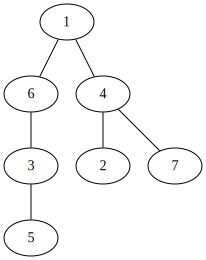
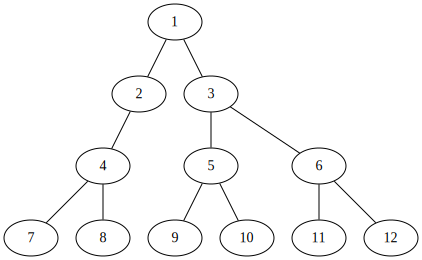

# 11725 트리의 부모 찾기

<table>
  <tr>
    <th>랭크</th>
    <th>상태</th>
  </tr>
  <tr>
    <td>
      <a href="http://noj.am/11725">
        
        Silver II, 11725 트리의 부모 찾기
      </a>
    </td>
    <td>
      성공
    </td>
  </tr>
</table>

## 문제 분석

노드의 개수 을 입력받고,
그 뒤로 개의 줄에 간선을 입력받습니다.
그래프를 입력받고 1번 노드을 루트라고 했을 때,
2번 노드부터 번 노드까지 해당 노드의 부모를 출력합니다.

## 풀이

두 노드가 연결되었다는 정보만으로는 부모가 둘 중 무엇인지 알 수 없습니다.
모든 노드를 연결한 후 1번 노드에서 탐색을 진행해 부모인 노드를 알아내야 합니다.

### 예제 입력 1

### 예제 입력 2

